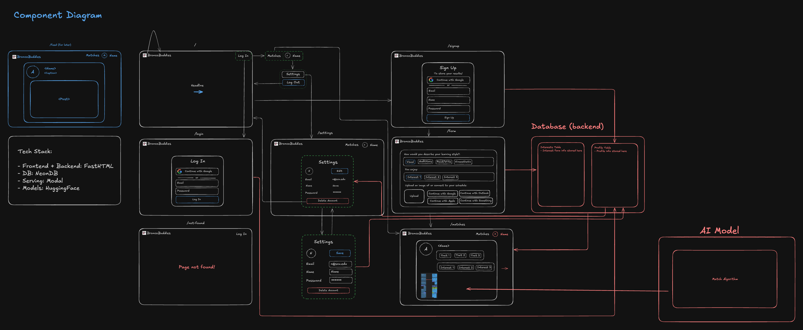

# bronco-buddies



## Development

### Set Up

Set up the environment:

```bash
curl -LsSf https://astral.sh/uv/install.sh | sh
uv sync
uv run pre-commit install
source .venv/bin/activate
modal setup
git clone https://github.com/Len-Stevens/Python-Antivirus.git
echo "export PYTHONPATH=.:$PYTHONPATH" >> ~/.bashrc
echo "export TOKENIZERS_PARALLELISM=false" >> ~/.bashrc
echo "export HF_HUB_ENABLE_HF_TRANSFER=1" >> ~/.bashrc
source ~/.bashrc
```

Note: you may need to run `source ~/.bashrc` to update your shell environment.

Create a `.env` (+ `.env.dev` + `.env.local`):

```bash
HF_TOKEN=

DATABASE_URL=
DOMAIN=

GITHUB_CLIENT_ID=
GITHUB_CLIENT_SECRET=
GOOGLE_CLIENT_ID=
GOOGLE_CLIENT_SECRET=

EMAIL_SENDER=
SMTP_SERVER=
SMTP_PORT=
SMTP_USERNAME=
SMTP_PASSWORD=
```

### Repository Structure

```bash
.
├── .github                 # GitHub Actions.
├── Python-Antivirus        # Python Antivirus.
├── src                     # code.
├── .pre-commit-config.yaml # pre-commit config
├── .python-version         # python version..
├── Makefile                # Makefile.
├── pyproject.toml          # project deps.
├── README.md               # README.
├── uv.lock                 # project deps lock.
```

### Unit tests

Run with:

```bash
uv run pytest -q
```

### Generating users

Run the script (run `make migrate MSG="your migration message" ENV={main|dev|local}` if you changed src/models.py):

```bash
uv run src/gen_users.py --num_users 10
```

Or on Modal:

```bash
source .venv/bin/activate
modal run -m src.gen_users --num_users 10
```

### App

Serve the app locally (run `make migrate MSG="your migration message" ENV={main|dev|local}` if you changed src/models.py):

```bash
uv run src/app.py
```

Or serve the app on Modal:

```bash
source .venv/bin/activate
modal serve -m src.app
```

Finally, deploy on main:

```bash
source .venv/bin/activate
modal deploy -m src.app
```
